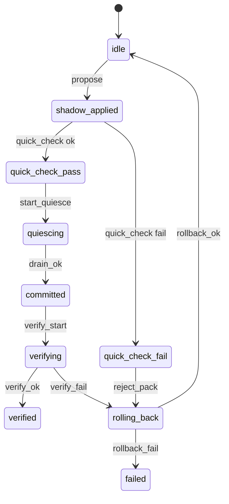

# CONTROL PROTOCOL AND GUARDRAILS: Phase A

Overview

This document defines the atomic apply protocol for configuration changes and the guardrails that ensure safety, stability, and acceptance for Phase A. It specifies state transitions, timing, micro A B quick-check, quiesce thresholds, commit, verify, and rollback. It also defines watchdogs, failure triage, and the fidelity model used during quick-check. Interfaces referenced are defined in [sim/API_SURFACE.md](sim/API_SURFACE.md). Data structures referenced are defined in [sim/DATA_CONTRACTS.md](sim/DATA_CONTRACTS.md). End to end acceptance criteria are exercised by tests described in [spec-first/tests/formal/test_end_to_end.py](spec-first/tests/formal/test_end_to_end.py).

Control-plane objectives for Phase A

- Safety first: no deadlocks or livelocks; thermal and power guardrails respected.
- Stability: geometry updates are damped, SPD projected, and trust-region bounded.
- Performance: a selected workload must improve throughput or tail latency by at least 10 percent relative to a fixed baseline policy with zero deadlocks.
- Overhead: geometry update and reconfiguration overhead less than or equal to 1 percent of simulated time per slow-loop cycle.

Control state machine

- States: idle, shadow_applied, quick_check_pass, quick_check_fail, quiescing, committed, verifying, verified, rolling_back, failed
- Transitions:
  - idle to shadow_applied on propose_reconfig
  - shadow_applied to quick_check_pass or quick_check_fail after quick_check
  - quick_check_pass to quiescing on quiesce start
  - quiescing to committed on drain conditions met
  - committed to verifying immediately
  - verifying to verified on pass or to rolling_back on fail
  - rolling_back to idle on success or to failed on rollback failure

Mermaid diagram

Atomic apply protocol

1) Propose and shadow-apply
- Input: ReconfigPack per [sim/DATA_CONTRACTS.md](sim/DATA_CONTRACTS.md) with pack_crc32c verified.
- Action: Build a shadow configuration and apply to a shadow instance of fast-plane routing tables, MC policies, CAT masks, CPU affinities, and DVFS states without touching the live instance.
- Preconditions:
  - Version compatibility check on pack.schema_version.
  - Mesh shape and counts must match the live system or be reducible by a documented projection.
  - Deadlock escape VCs must be present in router_tables.
  - Geometry trust-region bound satisfied relative to last committed GeometryTable.
- Outputs: proposal_id, state equals shadow_applied.

2) Micro A B quick-check (1 to 10 microseconds horizon)
- Purpose: Reject clearly bad configurations quickly and cheaply.
- Setup:
  - Duplicate initial conditions into two shadow worlds: baseline and candidate.
  - Run both for a micro-horizon using identical RNG seeds.
  - Sampling window: window_cycles equals horizon_us times link_rate in cycles per second rounded to an integer greater than or equal to 1.
- Metrics compared:
  - Throughput proxy: aggregate flit_tx per cycle, IPC proxy per tile.
  - Tail latency proxy: p99 of queue_depth or read_latency depending on workload class.
  - Thermal proxy: tdp_proxy_pu and thermal_ceiling_hits.
  - Deadlock or livelock indicators: zero forward progress for D cycles, loops in channel dependency graph.
- Acceptance thresholds (Phase A defaults, tunable per scenario):
  - Throughput_min_delta_pu greater than or equal to plus 0.03 relative to baseline during horizon.
  - Tail_latency_p99_max_increase_pu less than or equal to plus 0.02 relative to baseline.
  - Thermal_ceiling_hits equals 0 and tdp_proxy_pu less than or equal to 1.02.
  - Deadlock_livelock equals false.
- Outcome:
  - If all pass: state becomes quick_check_pass.
  - Else: quick_check_fail, auto rollback.

3) Quiesce
- Objective: Drain virtual channels to a safe threshold to ensure atomicity.
- Parameters:
  - vc_drain_threshold_flits default equals 4 for all VCs unless overridden by pack.apply_barrier.vc_drain_threshold_flits.
  - timeout_us default equals 2000.
- Procedure:
  - Apply candidate configuration to shadow hardware structures staged for commit.
  - Temporarily halt new injection from cores or reduce injection rate by 90 percent to accelerate drain while avoiding deadlock.
  - Wait until all link VCs have depth less than or equal to threshold; if timeout expires, abort and rollback.
- Output: commit_id on success; state becomes committed.

4) Commit
- Action: Swap shadow configuration into live configuration atomically at a global barrier on the next cycle boundary following quiesce success.
- Guarantees:
  - Config atomically replaces prior config; no mixed routing table states on any router.
  - CRCs rechecked post-copy; any mismatch triggers immediate rollback.

5) Verify
- Objective: Validate SLA on live system over a short verification window to catch model errors.
- Duration: verify_window_cycles default equals 10 times quick_check window_cycles, capped to 1 percent of slow-loop cadence cycles.
- Required checks:
  - SLA: throughput and tail-latency criteria equal or better than quick-check pass thresholds.
  - Integrity: no CRC mismatches on telemetry_frame or pack; no anomalies with severity equals error.
  - Deadlock: deadlock_flag equals false and forward progress greater than 0 for all D windows.
- Outcome:
  - verify_ok leads to verified state.
  - On violation leads to rolling_back.

6) Rollback
- Trigger conditions:
  - quick_check_fail.
  - quiesce_timeout.
  - verify_fail.
  - watchdog_timeout at any stage.
- Mechanism:
  - Re-apply the last verified commit pack via the same shadow, quiesce, commit sequence with elevated priority, and injection throttled to 0 to expedite drains.
- Outcome:
  - rollback_ok returns to idle.
  - rollback_fail leads to failed state with persistent safe mode: enforce escape routing only, minimal VC credits, strict throttles.

Guardrail checks

Deadlock-free routing constraint

- Structural: router_tables must include escape VCs configured to follow an acyclic routing function per tile grid, e.g., strictly dimension-ordered routing on escape VCs.
- Channel dependency graph: candidate weighted ECMP on non-escape VCs must not introduce cycles without an escape path.
- Control validation:
  - Check for at least one escape VC per router with deterministic DO turn model.
  - Verify no zero-credits configuration for any escape VC.
  - Reject packs missing deadlock escapes or with cyclic channel dependency without escape edges.

Fairness floors

- Router fairness: minimum service share per traffic class greater than or equal to 5 percent in windowed averages; detect starvation if a class receives less than 1 percent for 10 consecutive windows.
- Memory fairness: per-requester bandwidth less than 50 percent variance around median enforced by throttles if deviation persists for more than 5 windows.

Thermal and power guardrails

- Thermal ceiling: temp_c less than or equal to ceiling default equals 95 for all tiles; thermal_ceiling_hits must be 0 during quick_check and verify.
- Power proxy: tdp_proxy_pu less than or equal to 1.00 during quick_check and less than or equal to 1.05 during verify; temporary spikes above 1.05 for less than 1 window trigger warning but not rollback in Phase A.

Bounded geometry delta and gradient norms

- Trust-region: norm of delta g per tile normalized by baseline tile Frobenius norm must be less than or equal to trust_region_meta.max_delta_norm in 0 to 1.
- Gradient norms: average of grad_Phi magnitude must not increase by more than factor clamp_gamma default equals 1.5 from prior verified state over verify window.
- SPD and condition: post-projection SPD must hold with estimated condition number less than or equal to cond_number_bound; violations cause immediate reject.

Rollback policies and watchdogs

Watchdogs

- propose_watchdog_us default equals 1000: time budget for IR validation and shadow build.
- quick_check_watchdog_us default equals horizon_us plus 20 percent, minimum equals 100.
- quiesce_watchdog_us equals pack.apply_barrier.timeout_us.
- verify_watchdog_us default equals verify_window_cycles divided by cycles_per_us plus 20 percent.
- On watchdog timeout: trigger rollback and increment rollback_rate KPI.

Rollback prioritization

- Rollback commits preempt normal quick_check queues.
- Injection throttling to zero; after rollback, gradually ramp injection over 10 windows to avoid shock transients.

Quick-check fidelity and failure triage

Fidelity model

- Fast-plane micro-sim uses the same discrete link credit and queue model as live fast-plane but prunes slower devices such as DRAM timing to simplified token-latency proxies derived from last TelemetryFrame memory_metrics.
- Demand and supply matching:
  - Retain current token bucket rates for cores; freeze workload arrival during micro horizon to prevent speculative mispredictions.

Calibration

- On each verified commit, compute error between quick_check deltas and verify deltas:
  - throughput_delta_error equals abs(qc_delta minus verify_delta) divided by max(verify_delta_abs, epsilon)
  - tail_latency_delta_error equals abs(qc_delta minus verify_delta) divided by max(verify_delta_abs, epsilon)
- If average error across last N equals 5 is greater than thresholds greater than 0.3, tighten acceptance thresholds by multiplying by 1.2 conservative factor or extend horizon.

Failure triage categories

- Guardrail violation: deadlock risk, thermal exceedance, SPD violation; action: reject immediately.
- Modeling mismatch: quick_check pass but verify fail; action: adjust calibration, extend verify window, and mark config as suspect to avoid repeated attempts.
- Transient overload: quiesce timeout under burst; action: retry quiesce once with higher threshold equals threshold plus 2 and longer timeout equals plus 50 percent; otherwise rollback.

Inputs and outputs per control API

- propose_reconfig
  - Inputs: reconfig_pack, apply_mode equals shadow, quick_check_horizon_us in 1 to 10.
  - Outputs: proposal_id, accepted boolean; state equals shadow_applied on success.
  - Errors: guardrail_violation, pack_infeasible, serialization_error.

- quick_check
  - Inputs: proposal_id, horizon_us, acceptance_sla thresholds record.
  - Outputs: quick_check_report {throughput_delta_pu, tail_p99_delta_pu, tdp_proxy_pu, thermal_ceiling_hits, deadlock_livelock, decision}.
  - Errors: quick_check_fail, model_fidelity_error, watchdog_timeout.

- quiesce_and_commit
  - Inputs: proposal_id, vc_drain_threshold_flits, timeout_us.
  - Outputs: commit_id.
  - Errors: quiesce_timeout, stale_proposal.

- verify
  - Inputs: commit_id, canary_probes spec.
  - Outputs: verify_ok boolean, verify_report.
  - Errors: post_commit_sla_violation, watchdog_timeout.

- rollback
  - Inputs: from_commit_id or proposal_id.
  - Outputs: rollback_id, previous_commit_id.
  - Errors: rollback_conflict, watchdog_timeout.

Canary probes

- After commit and before verify, issue canary messages on each link in isolation to validate path correctness and measure one hop latency and credit responsiveness. Targets:
  - Per-link one hop latency within plus or minus 10 percent of baseline.
  - Credit return within expected cycles for the VC depth.
- Failures bypass verify and trigger rollback.

Quiesce thresholds and correctness

- Drain condition correctness proof sketch:
  - With injection throttled to near zero and finite buffers with credits, if the routing tables are not yet committed, packets are still governed by the old tables; by waiting for VC depth less than or equal to threshold on all channels, no in-flight flit can be misrouted under the new tables because commit is atomic and performed after depth reduces below threshold uniformly.
  - The escape VC remains configured to the old deterministic route until commit; threshold greater than 0 allows residual flits to avoid starvation.

On pack atomicity and integrity

- The ReconfigPack is versioned and validated as a single unit with pack_crc32c verified. Control refuses partial packs or partial application.
- Section-level CRCs for noc, memory, cpu_mem, dvfs, pr subsections are optional but recommended and, if present, are verified prior to quick_check.

Guardrail defaults for Phase A

- throughput_min_increase_pu: plus 0.05 for commit gating; quick_check uses plus 0.03.
- tail_latency_p99_max_increase_pu: plus 0.02 for both quick_check and verify.
- thermal_ceiling: 95 C; tdp_proxy_pu: less than or equal to 1.02 quick_check, less than or equal to 1.05 verify.
- trust_region_meta.max_delta_norm: default equals 0.25.
- cond_number_bound: default equals 1e5.
- vc_drain_threshold_flits: 4; quiesce timeout_us: 2000.

Metrics and logging

- Control produces ControlFrame records per stage with timestamps, decisions, and CRCs of inputs, and stores them alongside TelemetryFrame series for the run.
- KPIs computed:
  - rollback_rate equals number of rollbacks divided by number of proposals in percent.
  - reconfig_overhead equals time for PGGS plus field plus geometry plus pack plus control divided by slow-loop period in percent.
  - stability equals norm of successive geometry deltas aggregated; used as convergence indicator.

Risks and mitigations

- Deadlock risk from misconfigured weighted ECMP
  - Mitigation: enforce escape VC with dimension-ordered routing; pre-commit validation of channel dependency graph; canary probes.
- Instability in geometry updates leading to oscillations
  - Mitigation: damped CFE step, SPD projection, condition clamp, trust-region bound, verify gate using stability metric trend.
- Measurement noise in PGGS causing poor attribution
  - Mitigation: batch frames, use deterministic RNG seeds, require minimum variance condition to proceed, and fall back to prior atlas when insufficient_signal.
- High rollback frequency
  - Mitigation: calibrate quick-check thresholds, extend horizons adaptively, add memory of recent pack characteristics to avoid repeating known bad patterns.

References

- API calls: [sim/API_SURFACE.md](sim/API_SURFACE.md)
- Data contracts: [sim/DATA_CONTRACTS.md](sim/DATA_CONTRACTS.md)
- Formal end to end scaffolding: [spec-first/tests/formal/test_end_to_end.py](spec-first/tests/formal/test_end_to_end.py)