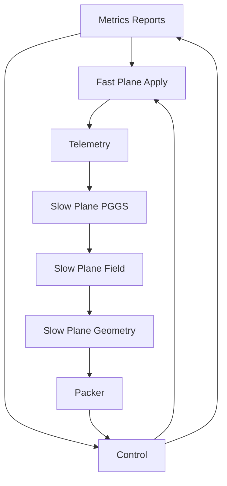

# LAYOUT: Phase A Skeleton Package Layout and Naming

Purpose

- Define the initial directory and file skeleton for Phase A aligned to repository practices in [AGENTS.md](AGENTS.md).
- Call out integration points with existing spec-first numerics and ULCC core libraries.
- Establish naming conventions, doc stubs, and locations for configs, tests, and CI artifacts.

Guiding principles

- Clear separation of concerns: fast_plane, telemetry, slow_plane, control, policies, harness, cft_ir.
- Determinism and guards: RNG seeded from harness, SPD and domain constraints per [AGENTS.md](AGENTS.md).
- Stable API surface: cross-module interfaces are specified in [sim/API_SURFACE.md](sim/API_SURFACE.md); data formats in [sim/DATA_CONTRACTS.md](sim/DATA_CONTRACTS.md).
- Control atomicity and safety per [sim/CONTROL_PROTOCOL.md](sim/CONTROL_PROTOCOL.md).
- Acceptance verification per [sim/TEST_PLAN.md](sim/TEST_PLAN.md).

Repository-level integration references

- Core geometry and dynamics for conceptual alignment: [ulcc_core.coords.theta_to_phi()](ulcc-core/coords.py:4), [ulcc_core.coords.phi_to_theta()](ulcc-core/coords.py:10), [ulcc_core.christoffel.gamma_theta()](ulcc-core/christoffel.py:4), [ulcc_core.dynamics.geodesic_rhs()](ulcc-core/dynamics.py:6), [ulcc_core.dynamics.ngd_step()](ulcc-core/dynamics.py:16)
- Discrete differential geometry scaffolding: [ulcc_ddg.metric_graph.Edge](ulcc-ddg/metric_graph.py:5), [ulcc_ddg.holonomy.holonomy_loop()](ulcc-ddg/holonomy.py:6), [ulcc_ddg.transport.parallel_transport_identity()](ulcc-ddg/transport.py:5)
- PGGS toy and sampler determinism: [ulcc_pggs.sampler.sample_paths()](ulcc_pggs/sampler.py:7), [pggs_toy.sampler.sample_paths()](pggs-toy/sampler.py:7)
- Spec-first numerics used as conceptual references: [spec-first/field/wave.py](spec-first/field/wave.py), [spec-first/geom/cfe_update.py](spec-first/geom/cfe_update.py), [spec-first/pggs/sampler.py](spec-first/pggs/sampler.py)
- End-to-end invariants and acceptance context: [spec-first/tests/formal/test_end_to_end.py](spec-first/tests/formal/test_end_to_end.py)

Symlink and namespace rule

- Maintain repo-root symlinks for namespace consistency across editors, pytest, and Docker. See [AGENTS.md](AGENTS.md) for required links and Docker notes.

Naming conventions

- Directories: lower_snake_case.
- Markdown docs: UpperCamelCase nouns or clear SCREAMING_SNAKE for specs, e.g., API_SURFACE.md.
- Config files: lower_snake_case with .json or .yaml extension (Phase A examples live under configs).
- Test files: test_*.md for doc-based specs, later test_*.py for executable tests under [tests](tests).

Top-level simulator documents

- [sim/API_SURFACE.md](sim/API_SURFACE.md): cross-module APIs and IR mapping
- [sim/DATA_CONTRACTS.md](sim/DATA_CONTRACTS.md): GeometryTable, TelemetryFrame, ReconfigPack schemas
- [sim/CONTROL_PROTOCOL.md](sim/CONTROL_PROTOCOL.md): atomic apply and guardrails
- [sim/TEST_PLAN.md](sim/TEST_PLAN.md): KPIs and acceptance tests
- [sim/ROADMAP_PHASE_A.md](sim/ROADMAP_PHASE_A.md): work plan and RACI (to be created)
- [sim/LAYOUT.md](sim/LAYOUT.md): this file

Phase A directory skeleton

cft_ir

- Purpose: IR types (GeomOp, FieldOp, DynOp, PGGSOp, GeomUpdateOp) and serialization contract.
- Files to create in implementation:
  - [cft_ir/README.md](cft_ir/README.md)
  - [cft_ir/ir_types.md](cft_ir/ir_types.md) documents IR records and versioning mapped from [sim/API_SURFACE.md](sim/API_SURFACE.md)

fast_plane

- Purpose: NoC mesh with credit-based flow control; token-bucket cores/accelerators; queuing cache MC model with MPKI and FR-FCFS approximation; task-graph scheduler with affinities priorities; power and thermal proxies.
- Files to create in implementation:
  - [fast_plane/README.md](fast_plane/README.md)
  - [fast_plane/noc.md](fast_plane/noc.md) NoC topology, VCs, credit rules, deadlock escape model
  - [fast_plane/cores_accels.md](fast_plane/cores_accels.md) token-bucket and workload interface
  - [fast_plane/cache_mc.md](fast_plane/cache_mc.md) MPKI-driven cache miss generator and FR-FCFS approximation model
  - [fast_plane/scheduler.md](fast_plane/scheduler.md) affinities, priorities, preemption, NUMA interactions
  - [fast_plane/power_thermal.md](fast_plane/power_thermal.md) proxy definitions and parameters

telemetry

- Purpose: PMU counters, link flit counts, queue depths, service times, MPKI, MC stats; micro-perturbation injection hooks.
- Files to create:
  - [telemetry/README.md](telemetry/README.md)
  - [telemetry/metrics_catalog.md](telemetry/metrics_catalog.md) enumerates metrics aligned to [sim/DATA_CONTRACTS.md](sim/DATA_CONTRACTS.md)
  - [telemetry/perturbations.md](telemetry/perturbations.md) permissible perturbations, ranges, safety checks

slow_plane

- Purpose: PGGS attribution, field solver on metric-aware 2-D stencil, geometry update (damped CFE with SPD projection and condition clamp), and geometry-to-pack compilation.
- Subdirectories and files:
  - [slow_plane/README.md](slow_plane/README.md)
  - pggs
    - [slow_plane/pggs/README.md](slow_plane/pggs/README.md)
    - [slow_plane/pggs/attribution.md](slow_plane/pggs/attribution.md) batch perturbation flows, proxies, budgets
  - field
    - [slow_plane/field/README.md](slow_plane/field/README.md)
    - [slow_plane/field/stencil.md](slow_plane/field/stencil.md) metric-aware stencil, boundary conditions, CFL checks
    - [slow_plane/field/solver_methods.md](slow_plane/field/solver_methods.md) leapfrog and CG parameters mapped from [spec-first/field/wave.py](spec-first/field/wave.py)
  - geometry
    - [slow_plane/geometry/README.md](slow_plane/geometry/README.md)
    - [slow_plane/geometry/cfe_damped_spd.md](slow_plane/geometry/cfe_damped_spd.md) damping, SPD projection, trust-region, condition clamps cross-referencing [spec-first/geom/cfe_update.py](spec-first/geom/cfe_update.py)
    - [slow_plane/geometry/tiling_encoding.md](slow_plane/geometry/tiling_encoding.md) GeometryTable encoding per [sim/DATA_CONTRACTS.md](sim/DATA_CONTRACTS.md)
  - packer
    - [slow_plane/packer/README.md](slow_plane/packer/README.md)
    - [slow_plane/packer/reconfig_pack.md](slow_plane/packer/reconfig_pack.md) routing tables, VC credits, link weights, MC policy words, CAT masks, CPU affinities, NUMA, DVFS

control

- Purpose: GCU emulator implementing propose shadow-apply, micro A B quick-check, quiesce, commit, verify, rollback, watchdogs.
- Files to create:
  - [control/README.md](control/README.md)
  - [control/protocol.md](control/protocol.md) should normatively mirror [sim/CONTROL_PROTOCOL.md](sim/CONTROL_PROTOCOL.md)
  - [control/guardrails.md](control/guardrails.md) deadlock routing checks, fairness floors, thermal power policies
  - [control/state_machine.md](control/state_machine.md) state definitions and transitions

policies

- Purpose: pluggable routers, MC arbitration, CAT, scheduler affinities, DVFS governors.
- Files to create:
  - [policies/README.md](policies/README.md)
  - [policies/router_policies.md](policies/router_policies.md) weighted ECMP, escape VC dimension-ordered baseline
  - [policies/mc_policies.md](policies/mc_policies.md)
  - [policies/cat_policies.md](policies/cat_policies.md)
  - [policies/scheduler_policies.md](policies/scheduler_policies.md)
  - [policies/dvfs_policies.md](policies/dvfs_policies.md)

harness

- Purpose: scenario runner, seed control, metrics, reporting, CI entry points.
- Files to create:
  - [harness/README.md](harness/README.md)
  - [harness/scenarios.md](harness/scenarios.md) W1 to W5 synthetic workloads per [sim/TEST_PLAN.md](sim/TEST_PLAN.md)
  - [harness/metrics_reporting.md](harness/metrics_reporting.md) CSV schemas and plots
  - [harness/rng_determinism.md](harness/rng_determinism.md) seed handling per [AGENTS.md](AGENTS.md)

configs

- Purpose: declarative scenarios, mesh sizes, VC configuration, slow-loop cadence, thresholds.
- Files to create:
  - [configs/README.md](configs/README.md)
  - [configs/scenario_A.json](configs/scenario_A.json)
  - [configs/scenario_B.json](configs/scenario_B.json)
  - [configs/policies_default.json](configs/policies_default.json)

tests

- Purpose: doc-based test specs and future executable tests.
- Files to create now:
  - [tests/README.md](tests/README.md)
  - [tests/test_acceptance.md](tests/test_acceptance.md) describes AT1 to AT5 from [sim/TEST_PLAN.md](sim/TEST_PLAN.md)
  - [tests/test_guardrails.md](tests/test_guardrails.md) routing deadlock, thermal, SPD, trust-region checks
  - [tests/test_overhead.md](tests/test_overhead.md) slow-loop overhead procedures
- Future executable tests (document now, implement later):
  - [tests/test_acceptance.py](tests/test_acceptance.py)
  - [tests/test_guardrails.py](tests/test_guardrails.py)
  - [tests/test_overhead.py](tests/test_overhead.py)

artifacts

- Purpose: output directory for TelemetryFrame, ControlFrame, KPI CSVs, and reports per [sim/TEST_PLAN.md](sim/TEST_PLAN.md).
- Structure (documented):
  - artifacts/run_{run_id}/frames/*.cbor
  - artifacts/run_{run_id}/control/*.jsonl
  - artifacts/run_{run_id}/kpi/*.csv
  - artifacts/reports/*.md

Integration callouts

- Field solver fidelity and CFL:
  - Align conceptual checks with [spec-first/field/wave.py](spec-first/field/wave.py) and ensure leapfrog CFL guard rails are documented in [slow_plane/field/stencil.md](slow_plane/field/stencil.md).
- Geometry update stability:
  - Damping, SPD projection, condition clamp, and trust-region logic documented in [slow_plane/geometry/cfe_damped_spd.md](slow_plane/geometry/cfe_damped_spd.md) consistent with [spec-first/geom/cfe_update.py](spec-first/geom/cfe_update.py).
- PGGS determinism:
  - Batch perturbation and attribution proxies aligned with [spec-first/pggs/sampler.py](spec-first/pggs/sampler.py) and seeds tracked in [harness/rng_determinism.md](harness/rng_determinism.md).
- Deadlock safety:
  - Escape VC dimension-ordered path guaranteed in baseline router policy; canary probe procedure documented in [control/guardrails.md](control/guardrails.md).

Make and CI entry points (document stubs)

- make sim: default scenario run; see [sim/TEST_PLAN.md](sim/TEST_PLAN.md)
- make sim-test: minimal matrix; see [sim/TEST_PLAN.md](sim/TEST_PLAN.md)
- pytest entries (future): match names in tests future *.py specs

Mermaid overview of module dependencies

Conventions and constraints

- Determinism: all randomized components must accept rng_seed from harness and log the seed in frame and control records.
- SPD and condition: GeometryTable production must enforce SPD and a condition clamp less than or equal to cond_number_bound per [sim/DATA_CONTRACTS.md](sim/DATA_CONTRACTS.md).
- Deadlock-free routing: escape VC configured to deterministic DO route and validated pre-commit per [sim/CONTROL_PROTOCOL.md](sim/CONTROL_PROTOCOL.md).
- Thermal power ceilings: thresholds defined in configs and enforced by control guardrails.

Deliverables to be created during implementation (Phase A)

- Module-level READMEs listed above with concrete parameter defaults, invariants, and examples.
- Scenario JSONs under [configs](configs).
- Doc-based tests under [tests](tests) mirroring acceptance and guardrail specs.

Traceability

- Each module doc should link back to relevant API sections in [sim/API_SURFACE.md](sim/API_SURFACE.md) and schemas in [sim/DATA_CONTRACTS.md](sim/DATA_CONTRACTS.md) to maintain end-to-end traceability.