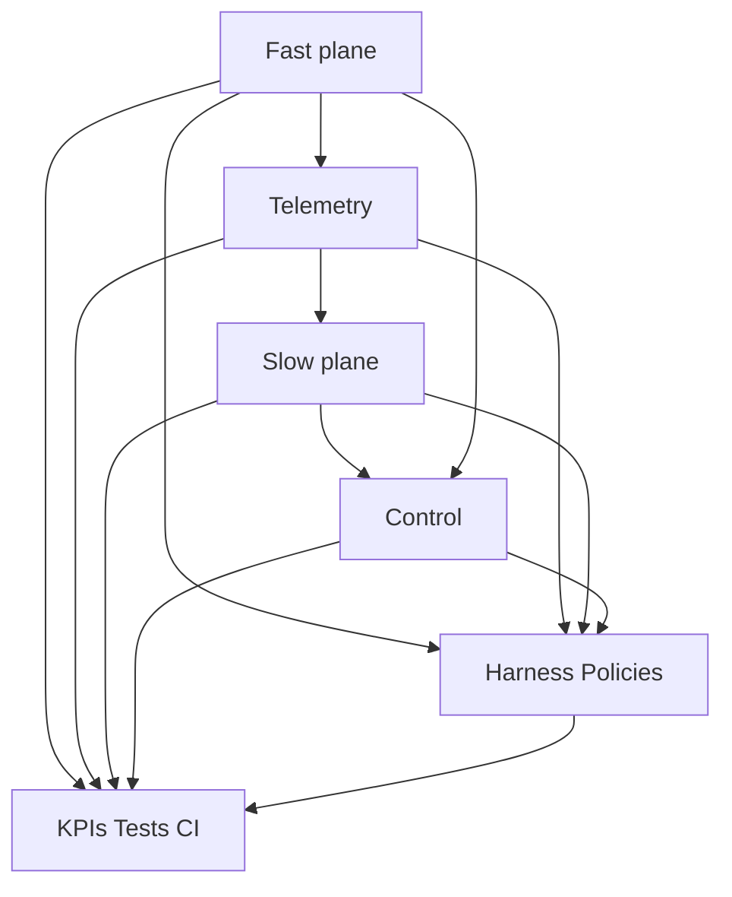
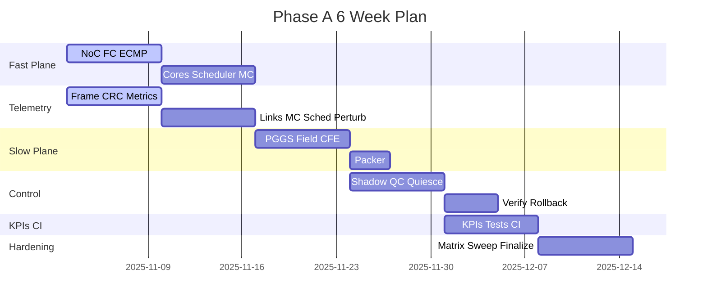

# ROADMAP: Phase A Minimal End-to-End SoC CFT Simulator

Purpose

- Define the 4 to 6 week roadmap for delivering a minimal end-to-end simulator with a fast compute plane, a slow geometric plane, and a control plane.
- Provide Work Breakdown Structure (WBS), epics and stories, dependencies, Definition of Done (DoD) per epic and for Phase A, a week-by-week plan, RACI responsibilities, staffing assumptions, and calendar risks.
- Align interfaces, data, and guardrails with the normative specs in:
  - [sim/API_SURFACE.md](sim/API_SURFACE.md)
  - [sim/DATA_CONTRACTS.md](sim/DATA_CONTRACTS.md)
  - [sim/CONTROL_PROTOCOL.md](sim/CONTROL_PROTOCOL.md)
  - [sim/TEST_PLAN.md](sim/TEST_PLAN.md)
  - [sim/LAYOUT.md](sim/LAYOUT.md)
  - Repository rules: [AGENTS.md](AGENTS.md)

Scope recap for Phase A

- Fast-plane skeleton: discrete-time mesh NoC with credit-based flow control and routing table weights; token-bucket cores/accelerators; queueing cache MC model with MPKI and FR-FCFS approximation; task-graph scheduler with affinities and priorities.
- Telemetry and perturbations: PMU and link counters per tile link, flit counts, queue depths, service time proxies, MPKI and MC stats; micro-perturbation hooks.
- Slow plane algorithmics: PGGS randomized batched perturbations with Shapley gradient proxies to produce atlas U, sources J, flux B; metric-aware 2-D stencil field solver (leapfrog or CG) producing Phi and grad-Phi; single damped CFE geometry step with SPD projection, condition clamp, trust-region logic; packer to ReconfigPack.
- Control plane: GCU emulator with ReconfigPack serializer, shadow-apply, micro A B quick-check, quiesce-and-commit, verify, rollback, watchdogs.
- Acceptance gates: improvement greater than or equal to 10 percent throughput or tail-latency vs fixed policy, no deadlocks livelocks, geometry overhead less than or equal to 1 percent per slow-loop, stable convergence with bounded oscillation; KPIs per [sim/TEST_PLAN.md](sim/TEST_PLAN.md).

Work Breakdown Structure (WBS)

Epic E1: Fast-plane skeleton [fast_plane](fast_plane)

- Stories
  - E1.S1 NoC mesh topology and credit-based flow control (2 VCs, 1 escape VC); weighted ECMP router tables.
  - E1.S2 Token-bucket cores and accelerators; workload loader; injection throttles.
  - E1.S3 Cache MC queueing approximation: MPKI-driven misses, FR-FCFS policy, timing proxies.
  - E1.S4 Task-graph scheduler with affinities priorities and preemption counters.
  - E1.S5 Power and thermal proxies per tile and DVFS state tracking.
- Inputs Outputs
  - Inputs: baseline policies from [policies](policies), workloads from [harness](harness).
  - Outputs: per-cycle step outcome and [TelemetryFrame](sim/DATA_CONTRACTS.md).

Epic E2: Telemetry and perturbations [telemetry](telemetry)

- Stories
  - E2.S1 PMU counter catalog and per-window aggregation.
  - E2.S2 Link metrics, VC depths, queue depths, stalls by cause.
  - E2.S3 Memory and scheduler metrics, MPKI, IPC proxies.
  - E2.S4 Micro-perturbation injection (latency, weights, credits), guardrails and ranges.
  - E2.S5 CRC integrity and frame versioning per [TelemetryFrame](sim/DATA_CONTRACTS.md).
- Outputs: windowed [TelemetryFrame](sim/DATA_CONTRACTS.md) with CRC and anomaly tags.

Epic E3: Slow plane algorithmics [slow_plane](slow_plane)

- Stories
  - E3.S1 PGGS attribution batch sampler with deterministic RNG and budgets; Shapley gradient proxy selection; export atlas U, sources J, flux B.
    - Conceptual alignment: [spec-first/pggs/sampler.py](spec-first/pggs/sampler.py)
  - E3.S2 Field solver on metric-aware 2-D stencil; leapfrog with CFL check and CG path; export Phi and grad-Phi.
    - Conceptual alignment: [spec-first/field/wave.py](spec-first/field/wave.py)
  - E3.S3 Damped CFE step with SPD projection and condition number clamp, trust-region acceptance; export GeometryTable.
    - Conceptual alignment: [spec-first/geom/cfe_update.py](spec-first/geom/cfe_update.py)
  - E3.S4 Packer compiling GeometryTable and policies to [ReconfigPack](sim/DATA_CONTRACTS.md).
- Outputs: GeometryTable, ReconfigPack, update_meta.

Epic E4: Control plane [control](control)

- Stories
  - E4.S1 ReconfigPack validation and shadow-apply.
  - E4.S2 Micro A B quick-check with identical RNG and horizon 1 to 10 microseconds.
  - E4.S3 Quiesce with VC drain thresholds and timeouts; commit with atomic swap and CRC recheck.
  - E4.S4 Verify on live window; rollback on SLA or watchdog violation; ControlFrame logging.
  - E4.S5 Guardrail checks: deadlock-free routing constraint, fairness floors, thermal and power ceilings, bounded geometry delta norms.
- Outputs: proposals, commits, rollback events, quick_check_report verify_report.

Epic E5: Harness and policies [harness](harness), [policies](policies)

- Stories
  - E5.S1 Scenario runner with seed control and fixed-policy baselines.
  - E5.S2 Policy modules: router weighted ECMP with escape VC, MC arbitration knobs, CAT masks, scheduler affinities, DVFS governors.
  - E5.S3 Metrics and reporting glue (CSV and plots per [sim/TEST_PLAN.md](sim/TEST_PLAN.md)).
- Outputs: run artifacts, baseline references.

Epic E6: KPIs, tests, and CI [tests](tests)

- Stories
  - E6.S1 KPI calculators with bootstrap CIs and Wilson intervals; CSV schemas.
  - E6.S2 Acceptance tests AT1 to AT5; guardrail tests; overhead bound tests.
  - E6.S3 CI wiring and Makefile targets (document-only in Phase A): make sim, make sim-test; pytest entry points.
- Outputs: reproducible reports and pass fail gates.

Dependencies

- E1 fast-plane is the foundation for E2 telemetry; E2 feeds E3 PGGS.
- E3 produces GeometryTable and ReconfigPack for E4 control.
- E5 harness operates across E1 E2 E3 E4 and provides baselines.
- E6 tests depend on all epics and documentation in [sim/TEST_PLAN.md](sim/TEST_PLAN.md).

Mermaid dependency overview

Definition of Done (DoD)

DoD per epic

- E1 Fast-plane
  - NoC and VCs simulate deterministically for 4 by 4 and 8 by 8 grids; escape VC always guarantees progress.
  - Token-bucket cores produce reproducible injection; MPKI and FR-FCFS approximations generate consistent latency distributions.
  - Scheduler executes affinities priorities and logs migrations and preemptions.
  - Telemetry snapshots from E2 reconcile with internal counters within 1 percent tolerance.

- E2 Telemetry
  - TelemetryFrame CRC validates; bounds checks and monotonicity rules pass on synthetic runs.
  - Micro-perturbation injections produce measurable, bounded changes in PMU counters without violating guardrails.

- E3 Slow plane
  - PGGS produces stable atlas U and sources J under fixed seeds; insufficient_signal path reuses previous atlas.
  - Field solver honors CFL limits; CG converges to tolerance; Phi and grad-Phi pass checksum and sanity ranges.
  - CFE step outputs SPD GeometryTable with condition number less than or equal to bound; trust-region acceptance toggles as expected.
  - Packer emits a versioned, atomic ReconfigPack with CRCs; deadlock escape config is present.

- E4 Control
  - Shadow-apply round trips; quick-check accuracy within specified error bands vs verify windows.
  - Quiesce meets thresholds within timeout; commit atomicity verified by canary probes.
  - Rollback executes within watchdog bounds and restores last verified config.

- E5 Harness Policies
  - Scenarios W1 to W5 run with seeds [0,1,2]; baselines captured; policy overrides load from configs.
  - Reports and CSVs conform to schemas in [sim/TEST_PLAN.md](sim/TEST_PLAN.md).

- E6 KPIs Tests CI
  - AT1 to AT5 pass for acceptance scenarios; guardrail tests prevent unsafe commits.
  - make sim and make sim-test documented and runnable once code exists; pytest entry points documented.

DoD for Phase A

- One acceptance workload shows greater than or equal to 10 percent throughput or tail-latency p99 improvement vs fixed policy baseline with no deadlocks or livelocks.
- Reconfiguration overhead less than or equal to 1 percent of simulated time per slow-loop cycle.
- Stability: successive geometry delta norms decreasing or bounded by trust-region for last 5 iterations; rollback_rate less than or equal to 20 percent during exploration.
- All guardrails are enforced; all CSV dashboards render; artifacts captured deterministically.

Week-by-week plan (6 weeks)

Assumptions

- Start date is calendar week N; adjust dates to team calendar. Identify holidays or off-days to derisk critical path.

Week 1: Foundations and baselines

- E1.S1 NoC mesh, credit-based FC, ECMP weights with escape VC; 4 by 4 grid prototype.
- E2.S1 frame schema draft and snapshot from E1; CRC integration.
- E5.S1 harness skeleton with seeds; W1 and W3 synthetic workload definitions.
- Deliverables: first TelemetryFrame from E1; baseline policies documented.
- Gate: Telemetry passes CRC and bounds in a short run.

Week 2: Complete fast-plane and telemetry

- E1.S2 token-bucket cores; E1.S3 MPKI FR-FCFS proxy; E1.S4 scheduler; E1.S5 power thermal proxies.
- E2.S2 link and VC metrics; E2.S3 memory scheduler metrics; E2.S4 perturbation hooks.
- E5.S2 policy modules default; E5.S3 reporting stubs.
- Gate: 8 by 8 runs produce stable TelemetryFrames; micro-perturbations measurable and safe.

Week 3: Slow plane algorithmics

- E3.S1 PGGS batch attribution with deterministic seeds and budgets; export atlas U, sources J, flux B.
- E3.S2 field solver leapfrog path with CFL guard; CG path scaffold.
- E3.S3 damped CFE step with SPD projection and condition clamp; trust-region acceptance logic.
- Gate: GeometryTable validates SPD and condition bound; field CFL checks active.

Week 4: Control plane and first end-to-end

- E3.S4 packer emits ReconfigPack with deadlock escape routes; CRC verified.
- E4.S1 shadow-apply; E4.S2 micro quick-check; E4.S3 quiesce and commit; E4.S4 verify; E4.S5 guardrails.
- First end-to-end closed loop with slow_loop_period equals 10k cycles; quick-check horizon equals 5 microseconds.
- Gate: first successful commit and verify; no guardrail violations.

Week 5: Stabilization and acceptance run

- Tune damping, trust-region, and budgets; overhead profiling; reduce slow-loop overhead to less than or equal to 1 percent.
- E6.S1 KPI calculators; E6.S2 acceptance tests AT1 to AT5; E6.S3 CI docs and Make targets.
- Gate: Acceptance Scenario A shows greater than or equal to 10 percent improvement with CI reports.

Week 6: Hardening and matrix sweep

- Sweep test matrix: grids (4 by 4, 8 by 8, 12 by 12), buffers (4,8,16), VC counts, workloads (W1 to W5), cadence, trust-region sizes, damping values, field methods.
- Address rollback hot spots; calibrate quick-check vs verify error; finalize documentation and dashboards.
- Gate: All acceptance gates satisfied; guardrails pass; report bundle ready.

Mermaid Gantt (illustrative)

RACI-like responsibility matrix

Roles

- A TL Architect
- R1 Fast-plane lead
- R2 Telemetry lead
- R3 Slow-plane lead
- R4 Control lead
- R5 Harness Test lead
- C Advisor Reviewer

Matrix (epics to roles)

- E1 Fast-plane: R equals R1, A equals TL, C equals R5
- E2 Telemetry: R equals R2, A equals TL, C equals R1
- E3 Slow-plane: R equals R3, A equals TL, C equals R2
- E4 Control: R equals R4, A equals TL, C equals R1 R3
- E5 Harness Policies: R equals R5, A equals TL, C equals R1 R2 R3 R4
- E6 KPIs Tests CI: R equals R5, A equals TL, C equals R2

Staffing assumptions

- Team size: 5 engineers plus TL.
  - R1 1.0 FTE, R2 0.6 FTE, R3 1.0 FTE, R4 1.0 FTE, R5 1.0 FTE, TL 0.5 FTE.
- Pairing moments: Week 3 R2 with R3 for telemetry feature importance mapping to PGGS; Week 4 R1 with R4 for quiesce thresholds.

Calendar risks and mitigations

- Risk: Holidays reduce effective capacity in Weeks 4 to 6.
  - Mitigation: pull-forward packer and quick-check to earlier in Week 4; maintain slack buffer of 2 to 3 days.
- Risk: Geometry instability causing frequent rollbacks.
  - Mitigation: conservative damping 0.5, trust-region radius 0.25 initial, condition bound 1e5; increase budgets only after stability trend.
- Risk: Quick-check fidelity misses regressions.
  - Mitigation: calibrate error vs verify windows and extend horizon; add canary probes per [sim/CONTROL_PROTOCOL.md](sim/CONTROL_PROTOCOL.md).
- Risk: Deadlock from misweighted ECMP tables.
  - Mitigation: enforce escape VC with deterministic dimension-ordered routing and pre-commit channel dependency validation; A B quick-check must reject any deadlock suspects.
- Risk: Measurement noise in PGGS.
  - Mitigation: batch frames and require minimum variance; fall back to previous atlas on insufficient_signal; deterministic RNG seeds per [AGENTS.md](AGENTS.md).

Critical acceptance checks and exit

- E2E improvement: greater than or equal to 10 percent throughput or tail-latency p99 on Acceptance Scenario A; tracked in AT1 of [sim/TEST_PLAN.md](sim/TEST_PLAN.md).
- Overhead: less than or equal to 1 percent slow-loop overhead; tracked in AT2.
- Safety: zero deadlock livelock; thermal ceiling not hit; tracked in AT3.
- Stability: SPD and condition clamp enforced; trust-region bounded; stability trend acceptable; tracked in AT4.
- Rollback discipline: rollback_rate less than or equal to 20 percent during matrix sweeps; tracked in AT5.

Traceability and alignment

- IR to simulator call mapping per [sim/API_SURFACE.md](sim/API_SURFACE.md): FieldOp, PGGSOp, GeomUpdateOp, GeomOp, DynOp.
- Data schemas per [sim/DATA_CONTRACTS.md](sim/DATA_CONTRACTS.md) with CRC integrity and SPD constraints.
- Control protocol per [sim/CONTROL_PROTOCOL.md](sim/CONTROL_PROTOCOL.md) with guardrails and watchdogs.
- Tests and KPIs per [sim/TEST_PLAN.md](sim/TEST_PLAN.md) with CI entry points documented.
- Integration with conceptual numerics:
  - Field: [spec-first/field/wave.py](spec-first/field/wave.py)
  - Geometry: [spec-first/geom/cfe_update.py](spec-first/geom/cfe_update.py)
  - PGGS: [spec-first/pggs/sampler.py](spec-first/pggs/sampler.py)
  - Stability experiments context: [ulcc-expts/bernoulli_vs_ngd.py](ulcc-expts/bernoulli_vs_ngd.py:5)

Out of scope for Phase A

- Physical power and thermal models beyond proxies.
- Detailed DRAM timing or coherence protocol simulation.
- Multi-atlas or multi-chart geometry beyond single-atlas U.
- Hardware PR bitstream execution; only metadata and size guardrails per [sim/DATA_CONTRACTS.md](sim/DATA_CONTRACTS.md).

Change management

- Any change to APIs, data contracts, or control rules must update the source documents and add a cross-reference section with semver bumps on schemas.
- Docs are the contract; code must conform to these documents.

Appendix: Story acceptance rubrics

- Each story includes:
  - Inputs, outputs, units and bounds.
  - Determinism guarantees with rng_seed propagation.
  - Guardrails and error taxonomy mapping to [sim/API_SURFACE.md](sim/API_SURFACE.md) and [sim/DATA_CONTRACTS.md](sim/DATA_CONTRACTS.md).
  - Test hooks and KPIs impacted.
